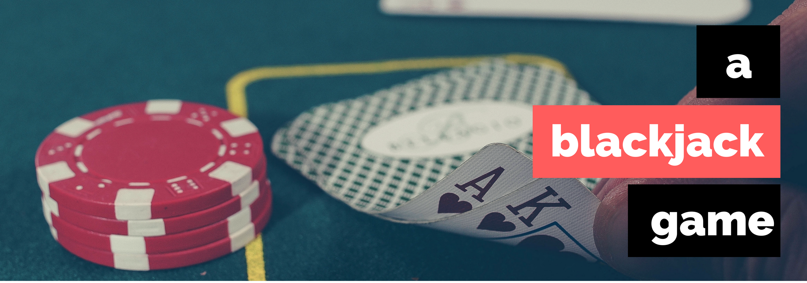

# BlackJack-

<b><a href="#overview">Overview</a></b>

Project based on [Uncle Bob's Code Kata](http://butunclebob.com/ArticleS.UncleBob.TheBowlingGameKata) TDD (test driven development) techniques. Created simple BlackJack game to practice TDD skills.

##  CREDITS

This project could not have been possible without the following indivduals:

* Adele Francois [[@skyyfall007]](https://github.com/skyyfall007) **Programmer**
* Maggie Muse  [[@mmuse90]](https://github.com/mmuse90)   **Programmer**

